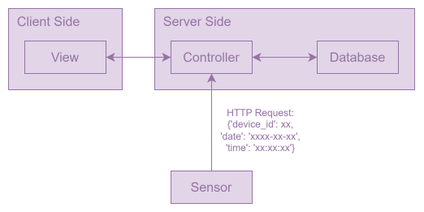
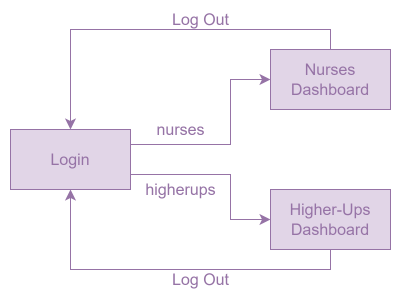

<!-- Logo -->

<!-- TABLE OF CONTENTS -->

   
Table of Contents

   <ol style="font-size: 1.4rem">
      <a href="#10-about-the-project">1.0 About The Project</a> 
      <a href="#20-built-with">2.0 Built With</a> 
      <a href="#30-how-it-works">3.0 How It Works</a> 
      <a href="#40-installation-windows">4.0 Installation (Windows)</a>
      <ol>
         <a href="#41-install--setup-xampp">4.1. Install & Setup XAMPP</a> 
         <a href="#42-modify-configurations">4.2. Modify Configurations</a> 
      </ol>
      <a href="#50-usage">5.0. Usage</a>
      <ol>
         <a href="#51-navigation-flow">5.1. Navigation Flow</a> 
         <a href="#52-navigation-steps">5.2. Navigation Steps</a> 
      </ol>
      <a href="#60-roadmap">6.0. Roadmap</a>
      <ol>
         <a href="#version-40-current-multiple-dashboard-modes">6.1. Version 4.0 (Current) Multiple Dashboard Modes</a> 
         <a href="#version-383-fully-functioning-full-stack-prototype">6.2. Version 3.8.3 Fully Functioning Full-Stack Prototype</a> 
         <a href="#version-21317-ui-design-data-generation-and-real-life-simulation-at-front-end">6.3. Version 2.13.17 UI Design, Data Generation, and Real Life Simulation at Front End</a> 
         <a href="#version-134-fundamental-structure">6.4. Version 1.3.4 Fundamental Structure</a> 
      </ol>
      <a href="#70-code-references">7.0. Code References</a> 
      <ol>
         <a href="#version-134">Version 1.3.4</a> 
         <a href="#version-21317">Version 2.13.17</a> 
         <a href="#version-4">Version 4</a> 
      </ol>
      <a href="#80-contact-information">8.0. Contact Information</a> 
   </ol>

# 1.0 About The Project

  In real life, a large number of nurses do not wash their hands sufficiently even if they know the importance and necessity of handwashing for their duties. This project is to provide a real-time web-based data visualization of nurses' performance in handwashing during their day shifts, with the application of nudging techniques and Human-Computer Interaction (HCI). This project aims to gently guide and influence nurses' behaviors and encourage higher handwashing frequency.

# 2.0 Built With

[![HTML][HTML.com]][HTML-url]
[![CSS][CSS.com]][CSS-url]
[![JavaScript][Javascript.com]][Javascript-url]
[![JQuery][JQuery.com]][JQuery-url]
[![PHP][PHP.com]][PHP-url]
[![CodeIgniter][Codeigniter.com]][Codeigniter-url]
[![Bootstrap][Bootstrap.com]][Bootstrap-url]
[![Mysql][Mysql.com]][Mysql-url]
[![Mariadb][Mariadb.com]][Mariadb-url]
[![Sqlite][Sqlite.com]][Sqlite-url]
[![Python][Python.com]][Python-url]
[![Linux][Linux.com]][Linux-url]
[![MarkDown][Markdown.com]][Markdown-url]

# 3.0 How It Works

The CodeIgniter 4 framework with Model-View-Controller (MVC) architecture is applied for project implementation. The following graph shows the basic structure of communication between components.

# 4.0 Installation (Windows)

## 4.1. Install & Setup XAMPP

1. Download and install [XAMPP][XAMPP]

2. Open XAMPP

3. Change Port:

   1. Config → Apache (httpd.conf)
   2. Change "Listen 80" to "Listen 8080"

4. Install "Apache" and "MySQL" services

5. Move the project folder to `/xampp_installation_path/htdocs/`

6. Start "Apache" and "MySQL" services

7. Go to the browser and view http://localhost:8080/lazycc/public

## 4.2. Modify Configurations

1. Uncomment local settings at `/lazycc/app/Config/App.php`

2. Uncomment local settings at `/lazycc/app/Views/login.php`

3. Uncomment local settings at `/lazycc/app/Views/dashboard_1.php`

4. Uncomment local settings at `/lazycc/app/Views/dashboard_2.php`

# 5.0. Usage

## 5.1. Navigation Flow

## 5.2. Navigation Steps

1. Open browser and type in the URL

   - Local URL: http://localhost:8080/lazycc/public
   - Remote URL: https://deco3801-lazycc.uqcloud.net/lazycc/

2. Enter access codes to view 2 different dashboards
   - Nurses Dashboard: _**nurses**_
   - Higher-ups Dashboard: _**higherups**_

# 6.0. Roadmap

## Version 4.0 (Current) Multiple Dashboard Modes

<input type="checkbox" checked> Feature 1: Design two modes of dashboards for different users (nurses & higher-ups)

<input type="checkbox" checked> Feature 2: Add bubble animation to login page

## Version 3.8.3 Fully Functioning Full-Stack Prototype

<input type="checkbox" checked> Feature 1: Establish database

<input type="checkbox" checked> Feature 2: Dashboard real-time update

&nbsp;&nbsp;&nbsp;&nbsp;<input type="checkbox" checked> Labels computation and update

&nbsp;&nbsp;&nbsp;&nbsp;<input type="checkbox" checked> Line chart computation and update

&nbsp;&nbsp;&nbsp;&nbsp;<input type="checkbox" checked> Donut chart computation and update

&nbsp;&nbsp;&nbsp;&nbsp;<input type="checkbox" checked> Stacked column chart computation and update

&nbsp;&nbsp;&nbsp;&nbsp;<input type="checkbox" checked> Add quick simulation mode

## Version 2.13.17 UI Design, Data Generation, and Real Life Simulation at Front End

<input type="checkbox" checked> Feature 1: Add water drop animation on login page

<input type="checkbox" checked> Feature 2: Add static labels, charts (line, donut, stacked column), titles, and tables with styling to the dashboard

&nbsp;&nbsp;&nbsp;&nbsp;<input type="checkbox" checked> Add customized scrollbar

<input type="checkbox" checked> Feature 3: Data generation for simulation at front-end

<input type="checkbox" checked> Feature 4: Simulation of real-time update (update labels, charts movements, add table rows)

<input type="checkbox" checked> Feature 5: User Authentication

&nbsp;&nbsp;&nbsp;&nbsp;<input type="checkbox" checked> Add error box for wrong access code

&nbsp;&nbsp;&nbsp;&nbsp;<input type="checkbox" checked> Set cookies

&nbsp;&nbsp;&nbsp;&nbsp;<input type="checkbox" checked> Add logout function using animated button

<input type="checkbox" checked> Feature 5: Configurations for different environments (local vs remote)

## Version 1.3.4 Fundamental Structure

<input type="checkbox" checked> Feature 1: Basic login view without authentication check

<input type="checkbox" checked> Feature 2: Charts and texts for fundamental dashboard structure with minimum styling

# 7.0. Code References

## Version 1.3.4

- [Donut Charts][donut-charts]

- [Line Charts][line-charts]

## Version 2.13.17

- [Charts (Line, Donut, Stacked Column)][charts]

- [Log Out Button][dashboard]

- [Dashboard]()

- [Table Scroll Bar][table-scroll-bar-url]

## Version 4

- [Bubbles Animation][bubbles-animation-url]

# 8.0. Contact Information

|     Name      |         Email          |
| :-----------: | :--------------------: |
| Andreas Wiora |   a.wiora@uq.net.au    |
|  Junjie Chen  | junjie.chen1@uq.net.au |
|  LungYu Lin   |  lungyu.lin@uq.net.au  |
| SiewHui Chun  | siewhui.chun@uq.net.au |
|   YuHan Hua   |  yuhan.hua@uq.net.au   |
|  Zixuan Cao   |  zixuan.cao@uq.net.au  |

<!-- Code References -->

[donut-charts]: https://www.w3schools.com/js/tryit.asp?filename=trychartjs_doughnut
[line-charts]: https://www.w3schools.com/js/tryit.asp?filename=tryai_chartjs_lines
[charts]: https://apexcharts.com/javascript-chart-demos/
[dashboard]: https://codepen.io/apexcharts/pen/pxZKqL
[bubbles-animation-url]: https://codepen.io/Mark_Bowley/pen/PozwyP
[table-scroll-bar-url]: https://codepen.io/devstreak/pen/dMYgeO

<!-- Other Links -->

[XAMPP]: https://www.apachefriends.org/download.html

<!-- Programming Languages -->

[PHP.com]: https://img.shields.io/badge/PHP-777BB4?style=for-the-badge&logo=php&logoColor=white
[PHP-url]: https://www.php.net/
[HTML.com]: https://img.shields.io/badge/HTML-239120?style=for-the-badge&logo=html5&logoColor=white
[HTML-url]: https://html.spec.whatwg.org/multipage/
[CSS.com]: https://img.shields.io/badge/CSS-239120?&style=for-the-badge&logo=css3&logoColor=white
[CSS-url]: https://www.w3.org/Style/CSS/
[Javascript.com]: https://img.shields.io/badge/JavaScript-F7DF1E?style=for-the-badge&logo=javascript&logoColor=black
[Javascript-url]: https://developer.mozilla.org/en-US/docs/Web/JavaScript
[Bootstrap.com]: https://img.shields.io/badge/Bootstrap-563D7C?style=for-the-badge&logo=bootstrap&logoColor=white
[Bootstrap-url]: https://getbootstrap.com
[JQuery.com]: https://img.shields.io/badge/jQuery-0769AD?style=for-the-badge&logo=jquery&logoColor=white
[JQuery-url]: https://jquery.com
[Python.com]: https://img.shields.io/badge/Python-14354C?style=for-the-badge&logo=python&logoColor=white
[Python-url]: https://www.python.org/
[Mysql.com]: https://img.shields.io/badge/MySQL-00000F?style=for-the-badge&logo=mysql&logoColor=white
[Mysql-url]: https://www.mysql.com/
[Mariadb.com]: https://img.shields.io/badge/MariaDB-003545?style=for-the-badge&logo=mariadb&logoColor=white
[Mariadb-url]: https://mariadb.com/
[Linux.com]: https://img.shields.io/badge/Linux-FCC624?style=for-the-badge&logo=linux&logoColor=black
[Linux-url]: https://www.kernel.org/
[Codeigniter.com]: https://img.shields.io/badge/CodeIgniter-%23EF4223.svg?style=for-the-badge&logo=codeIgniter&logoColor=white
[Codeigniter-url]: https://codeigniter.com/
[Sqlite.com]: https://img.shields.io/badge/SQLite-07405E?style=for-the-badge&logo=sqlite&logoColor=white
[Sqlite-url]: https://www.sqlite.org/index.html
[Markdown.com]: https://img.shields.io/badge/Markdown-000000?style=for-the-badge&logo=markdown&logoColor=white
[Markdown-url]: https://daringfireball.net/projects/markdown/
